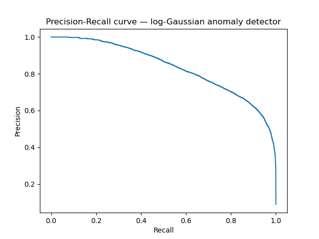

# MicroGuard — Real-Time Anomaly Detection from Scratch

MicroGuard is a real-time anomaly detection system for industrial IoT sensor data, built on a **multivariate Gaussian model ** and served through an interactive Streamlit dashboard.

Dataset: [IoT T-Sensor Dataset for Anomaly Detection](https://www.kaggle.com/datasets/diaealaouisoulimani/iot-t-sensor-dataset-for-anomaly-detection)(Kaggle)

Live App Demo : [https://micro-guard-kkylww2l2wbxsm6eajy85c.streamlit.app/]Click Here
-------------

## 1. Problem

Industrial machines emit continuous sensor readings (temperature, vibration,humidity, pressure, energy consumption). The goal is to flag readings that deviate from "normal" operating behavior in real time, so maintenance can be triggered before a failure occurs.

-------------

## Why only NumPy and Pandas and no heavy ML libraries in the inference path

The scoring engine (`gaussian.py`) is built with just NumPy for the math and Pandas for data handling because the target deployment context for a system like this is an **edge/IoT environment**: sensors and gateway devices sitting on a factory floor with limited RAM, limited compute, and often no GPU. A full ML stack (`scikit-learn`, `tensorflow`, `torch`, etc.) can pull in tens to hundreds of MB of dependencies and runtime overhead before a single prediction is made,
which is often more memory than the entire budget available on constrained edge hardware. A closed-form multivariate Gaussian, by contrast, is fully described by two small arrays — a mean vector and a covariance matrix — and scoring a new reading is a handful of NumPy operations with no frameworkoverhead.

This keeps the **inference footprint** deliberately small:

- **No retraining infrastructure needed at the edge:** `mu`/`sigma` are fit once (offline, in `analysis.ipynb`) and shipped as a frozen artifact; the device only ever runs `log_gaussian()`, never `fit()`.
- **Dependency footprint:** NumPy alone, versus the install size of a full ML framework — relevant when deploying to devices with limited flash storage as well as limited RAM.

`scikit-learn` is still used, but only offline in `analysis.ipynb`, for **validation** (`EllipticEnvelope` comparison, `f1_score`, precision-recall curves) — never in the code path that would actually run on-device. This mirrors a common real-world pattern: use full-featured libraries during model development and evaluation, then strip inference down to the minimum dependency surface for deployment.

-------------

## 2. Model

### Why a from-scratch Gaussian, and why log-space
A multivariate Gaussian fits a mean vector and covariance matrix to "normal" sensor readings, then scores new points by how unlikely they are under that distribution (equivalent to Mahalanobis distance).

Raw Gaussian densities underflow to `0.0` in high dimensions / far-from-mean points due to floating point limits. Working in **log-probability space** (`log_gaussian`) avoids this and keeps scores numerically stable and comparable across the whole dataset.

### 3a. Training set construction — avoiding contamination
Training only on rows where `machine_status == 0(the normal behaviour)` was not enough on its own: some "Running" rows were still flagged anomalous (a machine can show anomalous readings before formally transitioning to Failure). Training on those would have polluted the "normal" baseline with the exact points the model is meant to catch. The final training set filters on **both**:

clean_normal = df[(df['machine_status'] == 0) & (df['anomaly_flag'] == 0)]

### 3b. Threshold selection
Epsilon (log-probability cutoff) was swept across the observed score range and selected to maximize F1 on.Recall was treated as more important than precision — a missed failure is costlier than a false alarm.

## 4. Results

| Metric | Value |
|---|---|
| F1 | **0.7496** |
| Precision | **0.6676** |
| Recall | **0.8545** |
| Epsilon (log-space) | **-11.6296** |

**Precision-Recall curve:**

## 5. Architecture

MicroGuard/
├── analysis.ipynb        
├── gaussian.py           
├── data_simulator.py     
├── app.py                
├── model_params.npz      
├── pr_curve.png
├── requirements.txt
└── README.md

The dashboard **loads the frozen model** rather than refitting on every run — fitting happens once in `analysis.ipynb` and `app.py` only does inference.

## 6. Running 

pip install -r requirements.txt
streamlit run app.py

## 7. Limitations

- The Gaussian assumption may not hold for all failure modes; the PR curve shows precision dropping sharply past ~0.85    recall, suggesting a subset of anomalies don't separate cleanly from normal behavior under this model.
- Streamlit's rerun-on-interaction model means the "live stream" loop in `app.py` is a simplified simulation of real-time behavior, not a true background process — acceptable for a demo, would need `st.session_state`+ async handling or a separate backend for production use.
- Threshold was tuned for this dataset's specific anomaly distribution and would need re-calibration on new data or a different machine fleet.

## 8. Possible extensions
- Online updating of `mu`/`sigma` as new "normal" data arrives (concept drift)
- Per-machine models instead of one global Gaussian, since different machines may have different normal operating ranges
- Combine with `failure_type` to move from binary anomaly detection toward multi-class failure prediction